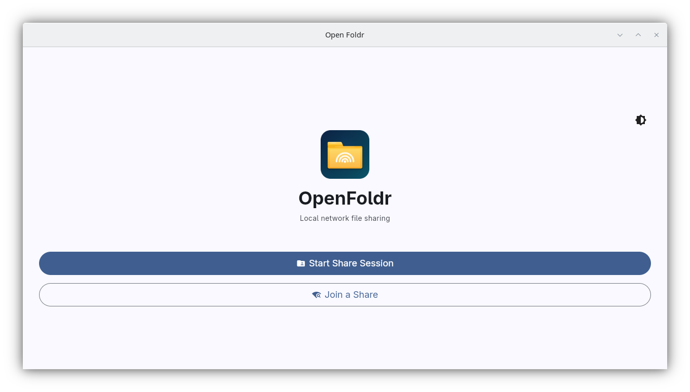
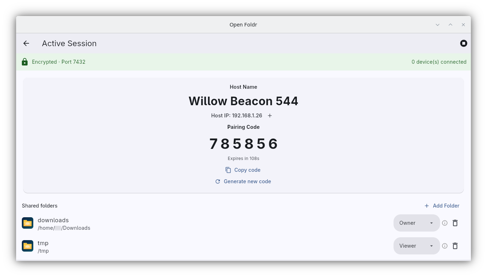
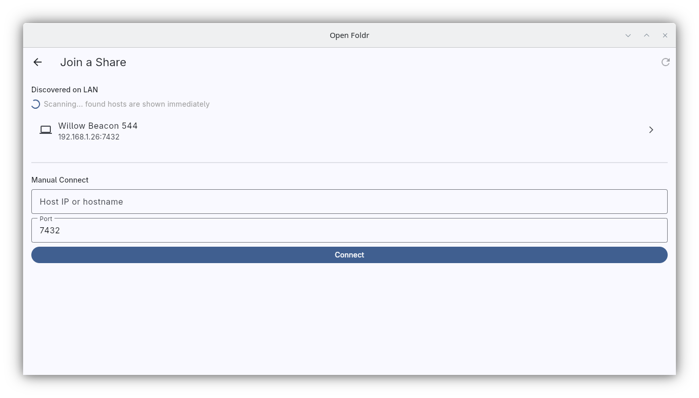
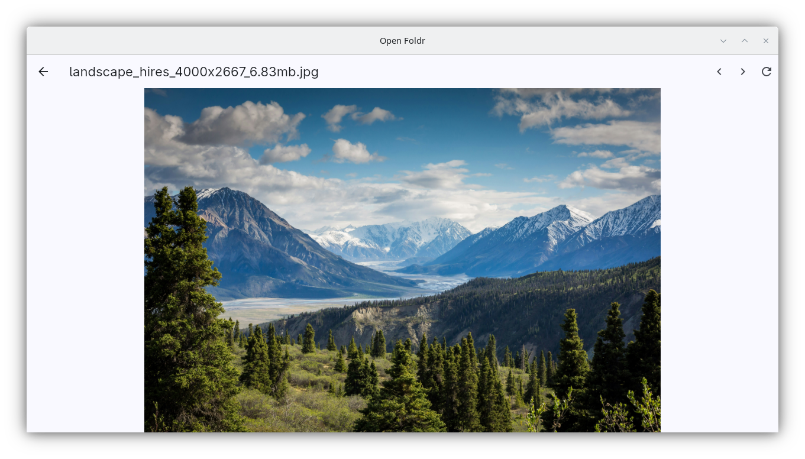
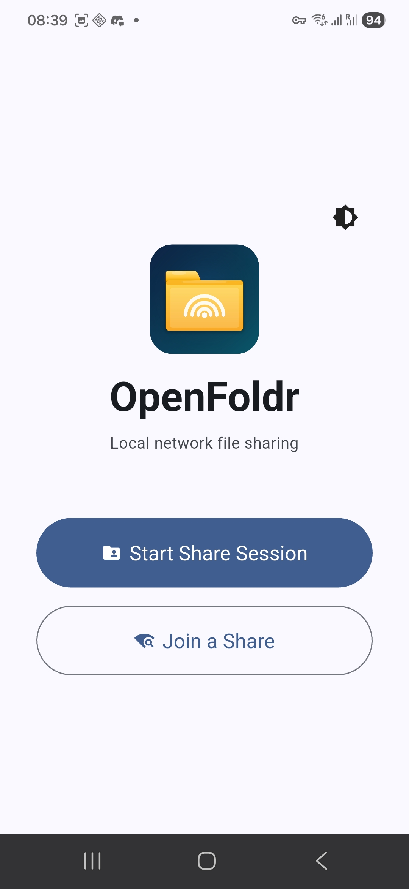
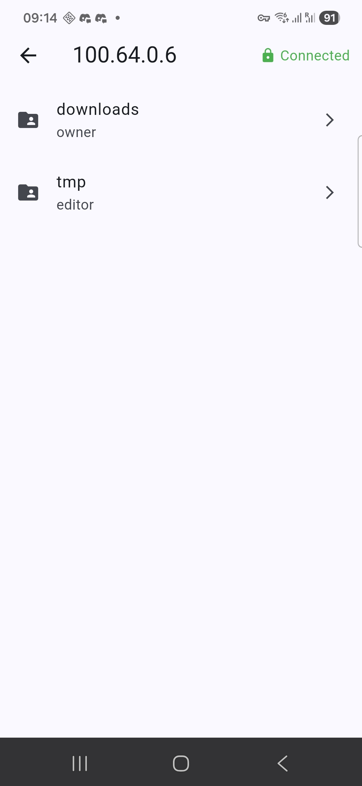
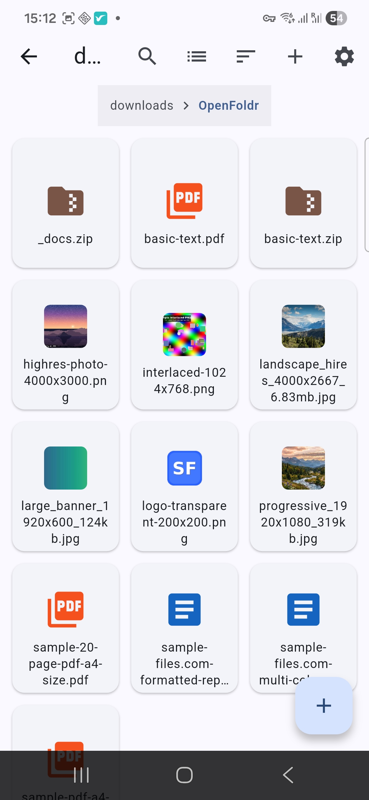
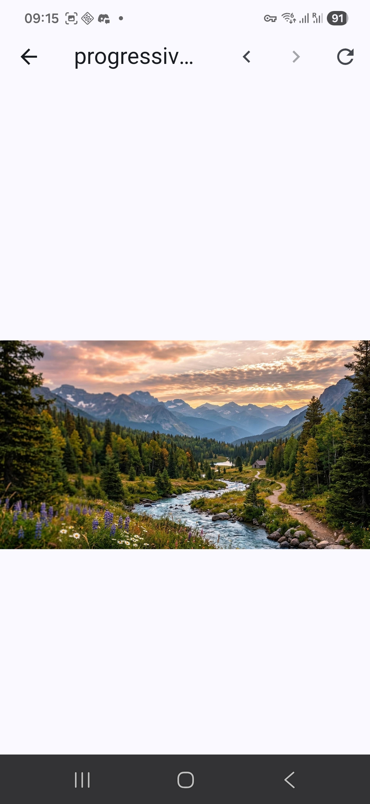

# OpenFoldr


OpenFoldr is a cross-platform app for sharing folders on your local network.

It is designed for fast LAN collaboration with controlled access and safer file operations.

## Download

Download the latest build from GitHub Releases:

- https://github.com/tumic21/open-foldr/releases

Release assets currently include:

- Linux Flatpak bundle: `openfoldr-<version>-linux.flatpak`
- Android APK: `openfoldr-<version>-android.apk`
- Windows installer: `openfoldr-<version>-windows-setup.exe`
- Windows portable ZIP: `openfoldr-<version>-windows-portable.zip`

## Supported Platforms

| Platform | Package | Status |
|---|---|---|
| Linux | Flatpak (`.flatpak`) | Stable |
| Android | APK (`.apk`) | Stable |
| Windows | Installer (`.exe`) | Stable |
| Windows | Portable ZIP (`.zip`) | Stable |

## Install And Run

### Linux (Flatpak)

1. Download the `.flatpak` asset from the latest release.
2. Install it:

```bash
flatpak install --user --bundle ./openfoldr-<version>-linux.flatpak
```

3. Run it:

```bash
flatpak run com.openfoldr.OpenFoldr
```

### Android (APK)

1. Download the `.apk` asset from the latest release.
2. On your Android device, allow installs from the source app (browser/files app).
3. Open the APK and complete installation.

### Windows (Installer)

1. Download the installer `.exe` asset from the latest release.
2. Run the installer and follow the setup wizard.
3. Start OpenFoldr from the Start menu or desktop shortcut.

### Windows (Portable ZIP)

1. Download the `.zip` asset from the latest release.
2. Extract it to any folder.
3. Run `open_foldr.exe`.

## Quick Start

1. Open OpenFoldr on two devices in the same local network.
2. On one device, start sharing a folder.
3. On the other device, connect to the host and browse or transfer files.

## Screenshots

### Desktop

| Home screen | Host session |
|---|---|
|  |  |

| Join share | File manager list |
|---|---|
|  |  |

### Android

| Home screen | Connect and roots |
|---|---|
|  |  |

| Grid view | Image preview |
|---|---|
|  |  |

## Troubleshooting

- Ensure both devices are on the same LAN.
- Allow OpenFoldr through firewall prompts when asked.
- If automatic discovery fails, connect manually using the host address.

## For Developers

- Development and local run instructions: [docs/development.md](docs/development.md)
- Security reporting: [SECURITY.md](SECURITY.md)

## License

Licensed under Apache License 2.0.
